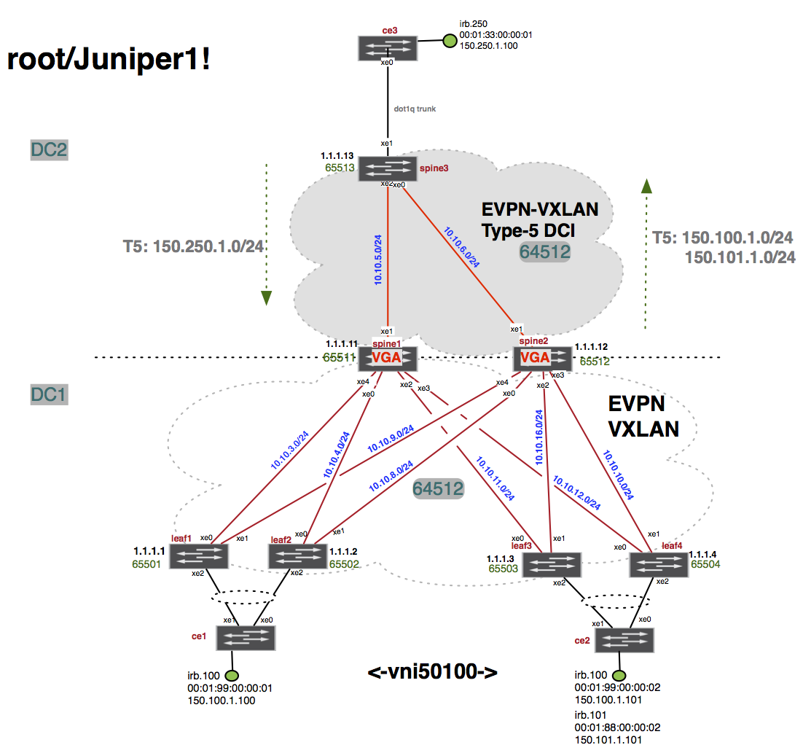

# EVPN-VXLAN lab Section 1 
## Centrally Routed Bridging Overlay architecture


### Lab topology



### Lab objectives

The goal of the section 1 is to build the **Centrally Routed Bridging Overlay** architecture using the Juniper QFX series EVPN-VXLAN technologies to deliver L2 active/active forwarding within the same broadcast-domain(same vlan-id) between the hosts connected to CE1 and CE2. 

The end-host emulation is done at the CE1/CE2 and core3-re by the IRB interfaces mapped to the given vlan - irb.100 at the ce1-re and irb.100, irb.101 at ce2-re inside the routing-instance TEST 

The iBGP overlay using EVPN-type2 routes will be used in order to advertise the MAC@ and MAC+IP between the leafs of the same fabric. 
 
The inter-vni routing will be taking place at the spine1-re and spine2-re therefore the MAC+IP routes will be injected by the spine1-re/Spine2-re on behalf of the layer 2 leafs. 
 
Spine3-re is deployed in DC-2 in a pure IP routed mode - connected to Spine1-re/Spine2-re underlay using OSPFv2 area 1 NSSA no-summary with OSPFv2 default-route being injected by spine3-re towards spine1-re/spine2-re. 

The ultimate goal of the lab section 1 is to deliver:
 - L2 communication between CE1 (VNI-50100) and CE2 (VNI 50100)
 - L3 inter-vni communication CE-1 VNI-50100 to CE-2 VNI-50101 
 - L3 communication between the DC-1 and DC-2 core3-re connected hosts (emulated by irb.250)

Spine3-re is to be deployed in underlay eBGP mode and should advertise only the default-route via eBGP to the border-spines spine1-re/spine2-re. 

### Lab environment

The  environment is composed of the following vqfx nodes: 
- 3 x vQFX Spines ( Spine1-re/Spine2-re are the EVPN-VXLAN enabled spines in DC-1, Spine3-re in DC-2 is enabled with IP underlay routing only )
- 4 x vQFX Leafs (L2 leafs in Section-1 and L2L3 leafs in Section-2)
- 2 x vQFX CEs (CE1-re/CE2-re dual homed to EVPN-VXLAN fabric in DC-1
- 1 x vQFX core3-re IP underlay connected to the Spine3-re in DC-2

The underlay eBGP is already pre-provisioned in order to deliver full IP reachability between the loopback0.0 IP@.  

> All VMs are accessible from internet, so you can run everything from your laptop using SSH sessions 

Use the username: `root` and password: `Juniper1!`

Here's the access information to your POD : [my_pod_access_info](pod1/README.md)

### Lab section 1 tasks

`L1-task1`: verify the full IPv4 underlay reachability within the  [section 1 topology](topologies/evpn-vxlan-techfest_topo1.png)

`L1-task2`: provision and verify the overlay iBGP(spine1/spine2 as overlay route-reflectors)  with EVPN signaling at all DC-1 fabric nodes using the local ASN 64512 as shown on the diagram

`L1-taks3`: enable and verify the underlay and overlay IP-ECMP within routing-options forwarding-options and protocol bgp level

`L1-task4`: provision the VNI values at the VLAN level - create vlan100 with vxlan vni 5100 

`L1-task5`: set the protocol evpn encapsulation type to vxlan, extended-vni list to the vni numbers 50100 and 50101 and the multicast-mode. 
            Make sure each given vni under evpn vni-options has vrf-target `target:x:y` defined 

`L1-task6`: provision a global route-target community for the default-switch EVI - EVPN-route type-1 dedicated global target community

`L1-task7`: enable per VNI route-target communities to be used in the 

`L1-task8`: provision an import policy-options policy-statement MY-FAB-IMP-POLICY to accept the global EVI route-target community and accept the customized per VNI target communities.
          Make sure that when the new VNI gets provisioned it's not going to be rejected due to the final reject term. 

`L1-task9`: put in place the switch-options vtep-source-interface, unique route-distinguisher, vrf-import policy-statement configured in previous task as well as the global switch-options EVI vrf-target target:1:8888 (Type1-evpn route dedicated)
          The global EVI vrf-target target:1:9999 is to be shared across all leaf nodes in the DC-1 and target:1:8888 for the spine1-re/spine2-re - set at the switch-options level

`L1-task10`: set the ESI 10 byte values all-active towards the CE1 and CE2
           ESI leaf1/leaf2 towards CE1: `00:01:01:01:01:01:01:01:01:01`
           ESI leaf3/leaf4 towards CE1: `00:01:02:02:02:02:02:02:02:02`
           
`L1-task11`: set the same active LACP system-id for the given AE interface towards the CE devices - same LACP system-id towards the given CE
            LACP system-id leaf1/leaf2: `00:00:01:00:00:01`
            LACP system-id leaf3/leaf4: `00:00:02:00:00:02`
                        
`L1-task12`: provision the active LACP protocol based aggregated AE interface at the CE1(dual homed to leaf1/leaf2) and CE2(dual homed to leaf3/leaf4)

`L1-task13`: enable the VLAN-ids on the LAG interfaces towards the CE1 and CE2

`L1-task14`: verify using local IRB.100 interfaces at CE1/CE2 that the L2 reachability works fine within the VNI 5100

`L1-task15`: verify the EVPN database and EVPN route information for the MAC@ 00:01:99:00:00:01 and 00:01:99:00:00:02 

`L1-task16`: provision at the spine1/spine2 the IRB-VGA IP gateway interfaces for vlan100 and vlan101 and allocate them into the routing-instance type virtual-router VRF-1
  
`L1-task17`: make sure the CE1 irb.100 sourced IP can ping the CE2 irb.101 destination IP

`L1-task18`: provision at leaf1 an additional regular extended community for the VNI 50100 and make sure the T2 MAC and MAC+IP routes at the leaf3/leaf4 gets the routes with an additional extended community 1:50100

`L1-task19`: at the spine3-re enabled the core ip routing connectivity between the DC-1 and DC-2 using OSPFv2 NSSA area 0.0.0.1 nssa no-summaries default-lsa default-metric 101 inside the existing routing-instance MY-IPVPN-1 virtual-router instance-type. 
             Same virtual-router instance MY-IPVRF-1 should be enabled in area 0.0.0.1 nssa at spine1-re/spine2-re in order to receive the default route 0.0.0.0/0 


| VLAN       | VNI           | Route-target  |
| ------------- |:-------------:| -----:|
| vlan100      | 50100      | target:1:100 |
| vlan101      | 50101      |  target:1:101 |


| Node-name     | Underlay ASN  | Overlay ASN | switch-options RD | lo0.0 IP@|
| ------------- |:-------------:| -----:|-----:|:-------------:|
| leaf1      | 65501 | 64512 | 1.1.1.1:1 | 1.1.1.1|
| leaf2      | 65502 | 64512   |   1.1.1.2:1 | 1.1.1.2|
| leaf3 | 65503      | 64512 |  1.1.1.3:1 | 1.1.1.3|
| leaf4 | 65504      | 64512 |   1.1.1.4:1 | 1.1.1.4| 
| spine1 | 65511      | 64512 |    1.1.1.11:1 | 1.1.1.11|
| spine2 | 65512      | 64512 |    1.1.1.12:1 | 1.1.1.12| 


### Solution guide for EVPN/VXLAN lab section 1 ####


Confirm connectivity to the leaf lo0 addresses of all leaf devices. 
These are exchanged via the underlay eBGP session and will be required to setup the overlay iBGP session between leaf devices

##### `L1-task1`: verify the full IPv4 underlay reachability within the  [section 1 topology](topologies/evpn-vxlan-techfest_topo1.png)

```
root@leaf1# run show bgp summary group underlay   
Groups: 2 Peers: 4 Down peers: 0
Table          Tot Paths  Act Paths Suppressed    History Damp State    Pending
bgp.evpn.0           
                     124         60          0          0          0          0
inet.0               
                       8          8          0          0          0          0
Peer                     AS      InPkt     OutPkt    OutQ   Flaps Last Up/Dwn State|#Active/Received/Accepted/Damped...
10.10.2.1             65512      10792      10903       0       0 3d 10:46:09 Establ
  inet.0: 4/4/4/0
10.10.4.1             65511      10804      10902       0       0 3d 10:46:29 Establ
  inet.0: 4/4/4/0

{master:0}[edit]
root@leaf1# 
{master:0}
root@leaf1> ping 1.1.1.11 source 1.1.1.1

root@leaf1> ping 1.1.1.12 source 1.1.1.1

root@leaf1> ping 1.1.1.2 source 1.1.1.1

root@leaf1> ping 1.1.1.3 source 1.1.1.1

root@leaf1> ping 1.1.1.4 source 1.1.1.1
```

## Part 1: Steps for setting up overlay on Leaf 1, Leaf 2, Leaf 3 and Leaf 4

#### Leaf-1 config

###### Setup MP-iBGP sessions with spine1/spine2 route-reflectors 

```
root@leaf1# show protocols bgp group overlay 
type internal;
local-address 1.1.1.1;
family evpn {
    signaling;
}
local-as 64512;
multipath;
neighbor 1.1.1.11;
neighbor 1.1.1.12;

{master:0}[edit]
root@leaf1# 
```

###### Leaf-2

```
root@leaf2# show protocols bgp group overlay 
type internal;
local-address 1.1.1.2;
family evpn {
    signaling;
}
local-as 64512;
multipath multiple-as;
neighbor 1.1.1.11;
neighbor 1.1.1.12;

{master:0}[edit]
root@leaf2# 
```
###### Spine1
```
root@spine1# show protocols bgp group overlay 
type internal;
local-address 1.1.1.11;
family evpn {
    signaling;
}
vpn-apply-export;
cluster 1.1.1.11;
local-as 64512;
multipath;
neighbor 1.1.1.12;
neighbor 1.1.1.1;
neighbor 1.1.1.2;
neighbor 1.1.1.3;
neighbor 1.1.1.4;

{master:0}[edit]
root@spine1# 
```

### Verification

Verify BGP connections between leaf devices and make sure they are established and evpn tables are reflected under the sessions

#### Leaf - 1
```root@leaf1# run show bgp summary group overlay 
Groups: 2 Peers: 4 Down peers: 0
Table          Tot Paths  Act Paths Suppressed    History Damp State    Pending
bgp.evpn.0           
                     124         60          0          0          0          0
inet.0               
                       8          8          0          0          0          0
Peer                     AS      InPkt     OutPkt    OutQ   Flaps Last Up/Dwn State|#Active/Received/Accepted/Damped...
1.1.1.11              64512       3759       2927       0       1    21:26:27 Establ
  bgp.evpn.0: 36/62/62/0
  default-switch.evpn.0: 35/61/61/0
  __default_evpn__.evpn.0: 1/1/1/0
1.1.1.12              64512       4202       3342       0       0  1d 0:45:59 Establ
  bgp.evpn.0: 24/62/62/0
  default-switch.evpn.0: 24/61/61/0
  __default_evpn__.evpn.0: 0/1/1/0

{master:0}[edit]
root@leaf1# 

```

## Part-2: Inter-VNI using Type 2 routes ( Asymmetric mode)
In this section we will configure  Leaf 1 and Leaf 3

Goal is to establish connectivity between Server 1 and Server 3 which are part of VNI 10 and VNI 30 respectively. Server 1 is only connected to Leaf 1 and Server 3 is only connected to Leaf 3. We need to configure both VNI 10 and VNI 30 on both Leaf 1 and Leaf 3

#### Leaf - 1

##### Step 1: Configure bridge domains bd10 and bd30 

```
{master:0}[edit]
root@LEAF-1# show vlans
bd10 {
    vlan-id 10;
    l3-interface irb.10;
    vxlan {
        vni 10;
    }
}
bd30 {
    vlan-id 30;
    l3-interface irb.30;
    vxlan {
        vni 30;
    }
}
```
Here we are creating bridge domain 10 and 30 and assigning them to VNI 10 and VNI 30 respectively. We are also assigning the IRB interface for routing.

##### Step 2: Configure IRB interface

```
{master:0}[edit]
root@LEAF-1# show interfaces irb
unit 10 {
    family inet {
        address 10.10.10.1/24 {
            virtual-gateway-address 10.10.10.100;
        }
    }
}
unit 30 {
    family inet {
        address 30.30.30.1/24 {
            virtual-gateway-address 30.30.30.100;
        }
    }
}
```

We are using the virtual-gateway-address model here. This address will serve as the default gateway for the servers. The virtual-gateway-address will be same on Leaf - 3 as well for both irb 10 and irb 30

##### Step 3: Assign server facing interface to the bridge domain

```

{master:0}[edit]
root@LEAF-1# show interfaces ae1
aggregated-ether-options {
    lacp {
        active;
        periodic fast;
        system-id 01:01:01:01:01:01;
    }
}
unit 0 {
    family ethernet-switching {
        interface-mode trunk;
        vlan {
            members all;
        }
    }
}

```

##### Step 4: Configure protocol evpn

```
root@LEAF-1# show protocols evpn
encapsulation vxlan;
extended-vni-list [ 10 30 ];
vni-options {
    vni 10 {
        vrf-target export target:1:10;
    }
    vni 30 {
        vrf-target export target:1:30;
    }
}
```

Here you specify what VNI the PE is interested in using extended-vni-list command. We also assign Route target to be exported for vni 10 and vni 30 for Type 2 and Type 3 routes. We also specify the dataplane encapsulation type as vxlan here.


##### Step 5: Configure switch-options

```
master:0}[edit]
root@LEAF-1# show switch-options
vtep-source-interface lo0.0;
route-distinguisher 1.1.1.1:100;
vrf-import EVPN-IMPORT;
vrf-target target:1:100;
```

Here we specify the local vtep endpoint as lo0.
Route distinguisher is specified to make local PE routes unique in case of overlapping addresses.
We also define the import ( EVPN-IMPORT) for Type1, Type2 and Type3 routes and export policy  for the Type 1 routes


##### Step 6: Configure Import policy for Type 1, Type 2 and Type 3 routes

```
{master:0}[edit]
root@LEAF-1# show policy-options
policy-statement EVPN-IMPORT {
    term ESI {
        from community esi;
        then accept;
    }
    term vni10 {
        from community vni10;
        then accept;
    }
    term vni30 {
        from community vni30;
        then accept;
    }
}

community esi members target:1:100;
community vni10 members target:1:10;
community vni30 members target:1:30;
```

##### Step 7: Configure routing instance
```
root@LEAF-1# show routing-instances VRF-1
instance-type vrf;
interface irb.10;
interface irb.30;
interface lo0.10;
route-distinguisher 1.1.1.10:10;
vrf-target target:10:10;
```
Here we create IP VRF and put the IRB interfaces in. The RD and RT configured here are for IP VRF and are different from the MAC VRF.

Please make sure you assign lo0.10 in the VRF

##### Step 8: Configure lo0.10 
```

{master:0}[edit]
root@LEAF-1# show interfaces lo0
unit 0 {
    family inet {
        address 1.1.1.1/32;
    }
}
unit 10 {
    family inet {
        address 1.1.1.10/32;
    }
}

```

Now we move to Leaf - 3

#### Leaf - 3

##### Step 1: Configure bridge domains bd10 and bd30 

```
{master:0}[edit]
root@LEAF-3# show vlans
bd10 {
    vlan-id 10;
    l3-interface irb.10;
    vxlan {
        vni 10;
    }
}
bd30 {
    vlan-id 30;
    l3-interface irb.30;
    vxlan {
        vni 30;
    }
}
```
Here we are creating bridge domain 10 and 30 and assigning them to VNI 10 and VNI 30 respectively. We are also assigning the IRB interface for routing.

##### Step 2: Configure IRB interface

```
{master:0}[edit]
root@LEAF-3# show interfaces irb
unit 10 {
    family inet {
        address 10.10.10.3/24 {
            virtual-gateway-address 10.10.10.100;
        }
    }
}
unit 30 {
    family inet {
        address 30.30.30.3/24 {
            virtual-gateway-address 30.30.30.100;
        }
    }
}
```

We are using the virtual-gateway-address model here. This address will serve as the default gateway for the servers. The virtual-gateway-address will be same on Leaf - 3 as well for both irb 10 and irb 30

##### Step 3: Assign server facing interface to the bridge domain

```

{master:0}[edit]
root@LEAF-3# show interfaces ae1
aggregated-ether-options {
    lacp {
        active;
        periodic fast;
        system-id 03:03:03:03:03:03;
    }
}
unit 0 {
    family ethernet-switching {
        interface-mode trunk;
        vlan {
            members all;
        }
    }
}
```

##### Step 4: Configure protocol evpn

```
root@LEAF-3# show protocols evpn
encapsulation vxlan;
extended-vni-list [ 10 30 ];
vni-options {
    vni 10 {
        vrf-target export target:1:10;
    }
    vni 30 {
        vrf-target export target:1:30;
    }
}
```

Here you specify what VNI the PE is interested in using extended-vni-list command. We also assign Route target to be exported for vni 10 and vni 30 for Type 2 and Type 3 routes. We also specify the dataplane encapsulation type as vxlan here.


##### Step 5: Configure switch-options

```
{master:0}[edit]
root@LEAF-3# show switch-options
vtep-source-interface lo0.0;
route-distinguisher 3.3.3.3:100;
vrf-import EVPN-IMPORT;
vrf-target target:1:100;
```

Here we specify the local vtep endpoint as lo0.
Route distinguisher is specified to make local PE routes unique in case of overlapping addresses.
We also define the import ( EVPN-IMPORT) for Type1, Type2 and Type3 routes and export policy  for the Type 1 routes


##### Step 6: Configure Import policy for Type 1, Type 2 and Type 3 routes

```
{master:0}[edit]
root@LEAF-3# show policy-options
policy-statement EVPN-IMPORT {
    term ESI {
        from community esi;
        then accept;
    }
    term vni10 {
        from community vni10;
        then accept;
    }
    term vni30 {
        from community vni30;
        then accept;
    }
}

community esi members target:1:100;
community vni10 members target:1:10;
community vni30 members target:1:30;
```

##### Step 7: Configure routing instance
```
root@LEAF-3# show routing-instances VRF-1
instance-type vrf;
interface irb.10;
interface irb.30;
interface lo0.10;
route-distinguisher 3.3.3.10:10;
vrf-target target:10:10;
```
Here we create IP VRF and put the IRB interfaces in. The RD and RT configured here are for IP VRF and are different from the MAC VRF.

Please make sure you assign lo0.10 in the VRF

##### Step 8: Configure lo0.10 
```

{master:0}[edit]
root@LEAF-3# show interfaces lo0
unit 0 {
    family inet {
        address 3.3.3.3/32;
    }
}
unit 10 {
    family inet {
        address 3.3.3.10/32;
    }
}

```

#### Verify connectivity between Server 1 and Server 3

Console into server 1 and server 3

Login: ravello/ravelloCloud

##### Ping between Server 1 and Server 3

From Server 1:

>Ping 30.30.30.30

From Server 3:

>Ping 10.10.10.10

###### Note
```
If the pings do not work to remote server, try the ping from the remote side as well
```

Although Server 1 is just connected to Leaf 1 and Server 3 is just connected to Leaf 3, we have configured both VNI 10 and VNI 30 on both leaves. This demonstrates the type 2 asymmetric routing case that we discussed earlier.

Server 1 is configured with irb.10 virtual gateway address as its gateway and Server 3 is configured with irb.30 virtual gateway address as its gateway

Lets check for the forwarding state on leaf 1 and leaf 2


##### Leaf 1:
Lets find the type 2 route for 30.30.30.30
```sh
{master:0}
root@LEAF-1> show route table default-switch.evpn.0 extensive | find 30.30.30.30
2:3.3.3.3:100::30::2c:c2:60:52:80:a8::30.30.30.30/304 (1 entry, 1 announced)
        *BGP    Preference: 170/-101
                Route Distinguisher: 3.3.3.3:100
                Next hop type: Indirect, Next hop index: 0
                Address: 0x9db6970
                Next-hop reference count: 28
                Source: 3.3.3.3
                Protocol next hop: 3.3.3.3
                Indirect next hop: 0x2 no-forward INH Session ID: 0x0
                State: <Secondary Active Int Ext>
                Local AS: 65001 Peer AS: 65100
                Age: 19:34      Metric2: 0 
                Validation State: unverified 
                Task: BGP_65100_65100.3.3.3.3
                Announcement bits (1): 0-default-switch-evpn 
                AS path: I
                Communities: target:1:30 encapsulation0:0:0:0:vxlan
                Import Accepted
                Route Label: 30
                ESI: 00:00:00:00:00:00:00:00:00:00
                Localpref: 100
                Router ID: 3.3.3.3
                Primary Routing Table bgp.evpn.0
                Indirect next hops: 1
                        Protocol next hop: 3.3.3.3
                        Indirect next hop: 0x2 no-forward INH Session ID: 0x0
                        Indirect path forwarding next hops: 1
                                Next hop type: Router
                                Next hop: 192.168.10.2 via xe-0/0/0.0
                                Session Id: 0x0
                        3.3.3.3/32 Originating RIB: inet.0
                          Node path count: 1
                          Forwarding nexthops: 1
                                Nexthop: 192.168.10.2 via xe-0/0/0.0


root@LEAF-1> show arp no-resolve | match 30.30.30.30 
2c:c2:60:52:80:a8 30.30.30.30     irb.30 [vtep.32770]      permanent remote


root@LEAF-1> show interfaces vtep.32770 
  Logical interface vtep.32770 (Index 572) (SNMP ifIndex 543)
    Flags: Up SNMP-Traps Encapsulation: ENET2
    VXLAN Endpoint Type: Remote, VXLAN Endpoint Address: 3.3.3.3, L2 Routing Instance: default-switch, L3 Routing Instance: default
    Input packets : 24
    Output packets: 83
    Protocol eth-switch, MTU: Unlimited
      Flags: Trunk-Mode

root@LEAF-1> show evpn database mac-address 2c:c2:60:52:80:a8 extensive 
Instance: default-switch

VN Identifier: 30, MAC address: 2c:c2:60:52:80:a8
  Source: 3.3.3.3, Rank: 1, Status: Active
    Timestamp: May 14 23:11:06 (0x5918e40a)
    State: <Remote-To-Local-Adv-Done>
    IP address: 30.30.30.30
```

Follow the same steps on Leaf 3 for IP address 10.10.10.10


At this point you will not be able to ping 20.20.20.20 from Leaf 1, Leaf 3 and Leaf 4 as there is no VNI 20 present on these leaves. Hence there is not type 2 routes exchanged for 20.20.20.20

For the same reason you will not be able to ping 40.40.40.40 from Leaf 1, Leaf 2 and Leaf 3

In the next section we will enable Type 5 routes on all the leaves so that we can establish the reachability. Since this connectivity is established via Type 5 routes we do not need to configure VNI 20 and VNI 40 on remote leaves. This demonstrates symmetric routing use case. Remote leaves will use L3 VNI 5555


## Part-3: Inter-VNI using Type 5 routes ( Symmetric mode)

We will first configure Type 5 routes on Leaf 2 and Leaf 4 to show that they are communicating using Type 5 routes. No Type 2 routes are exchanged between Leaf 2 and Leaf 4 as they do not have each others VNI

#### Leaf - 2
##### Step 1: Configure bridge domains bd20 

```
{master:0}
root@LEAF-2> show configuration vlans
bd20 {
    vlan-id 20;
    l3-interface irb.20;
    vxlan {
        vni 20;
    }
}

```
##### Step 2: Configure IRB interface
```
root@LEAF-2> show configuration interfaces irb
unit 20 {
    family inet {
        address 20.20.20.100/24;
    }
}
```
##### Step 3: Assign server facing interface to the bridge domain

```
{master:0}
root@LEAF-2> show configuration interfaces xe-0/0/2
description "to VLAN20";
unit 0 {
    family ethernet-switching {
        interface-mode trunk;
        vlan {
            members all;
        }
    }
}
```

##### Step 4: Configure protocol evpn
```
root@LEAF-2> show configuration protocols evpn
encapsulation vxlan;
```

Since we are using Type 5 routes there is no need to configure anything else here.

##### Step 5: Configure switch-options

```
master:0}
root@LEAF-2> show configuration switch-options
vtep-source-interface lo0.0;
route-distinguisher 2.2.2.2:100;
vrf-target target:1:100;
```

We do not need the EVPN-IMPORT policy here since we are not using Type 2 routes here

##### Step 6: Configure routing instance

```

{master:0}
root@LEAF-2> show configuration routing-instances
VRF-1 {
    instance-type vrf;
    interface irb.20;
    interface lo0.10;
    route-distinguisher 2.2.2.10:10;
    vrf-target target:10:10;
    protocols {
        evpn {
            ip-prefix-routes {
                advertise direct-nexthop;
                encapsulation vxlan;
                vni 5555;
            }
        }
    }
}

```
The "protocol evpn" configuration under the VRF enables the Type 5 routes. We are using vni 5555 as the L3 vni.


##### Step 7: Configure lo0.10 

```
{master:0}
root@LEAF-2> show configuration interfaces lo0
unit 0 {
    family inet {
        address 2.2.2.2/32;
    }
}
unit 10 {
    family inet {
        address 2.2.2.10/32;
    }
}
```


#### Leaf - 4
##### Step 1: Configure bridge domains bd20 

```
{master:0}
root@LEAF-4> show configuration vlans
bd40 {
    vlan-id 40;
    l3-interface irb.40;
    vxlan {
        vni 40;
    }
}

```
##### Step 2: Configure IRB interface
```
{master:0}
root@LEAF-4> show configuration interfaces irb
unit 40 {
    family inet {
        address 40.40.40.100/24;
    }
}
```
##### Step 3: Assign server facing interface to the bridge domain

```
{master:0}
root@LEAF-4> show configuration interfaces xe-0/0/2
unit 0 {
    family ethernet-switching {
        interface-mode trunk;
        vlan {
            members all;
        }
    }
}
```

##### Step 4: Configure protocol evpn
```
root@LEAF-4> show configuration protocols evpn
encapsulation vxlan;
```

Since we are using Type 5 routes there is no need to configure anything else here.

##### Step 5: Configure switch-options

```
{master:0}
root@LEAF-4> show configuration switch-options
vtep-source-interface lo0.0;
route-distinguisher 4.4.4.4:100;
vrf-target target:1:100;
```

We do not need the EVPN-IMPORT policy here since we are not using Type 2 routes here

##### Step 6: Configure routing instance

```

{master:0}
root@LEAF-4> show configuration routing-instances
VRF-1 {
    instance-type vrf;
    interface irb.40;
    interface lo0.10;
    route-distinguisher 4.4.4.10:10;
    vrf-target target:10:10;
    protocols {
        evpn {
            ip-prefix-routes {
                advertise direct-nexthop;
                encapsulation vxlan;
                vni 5555;
            }
        }
    }
}

```
The "protocol evpn" configuration under the VRF enables the Type 5 routes. We are using vni 5555 as the L3 vni.


##### Step 7: Configure lo0.10 

```
{master:0}
root@LEAF-4> show configuration interfaces lo0
unit 0 {
    family inet {
        address 4.4.4.4/32;
    }
}
unit 10 {
    family inet {
    
        address 4.4.4.10/32;
    }
}
```


#### Verification

Console into Server 2 and Server 4

Login: ravello/ravelloCloud

##### Ping between Server 2 and Server 4

From Server 2:

>Ping 40.40.40.40

From Server 4:

>Ping 20.20.20.20

###### Note
```
If the pings do not work to remote server, try the ping from the remote side as well
```

At this point we cannot ping Server 2 and Server 4 from Server 1 and Server 3

We need to enable type 5 route on Leaf 1 and Leaf 3

#### Enable Type 5 on Leaf 1 and Leaf 3

##### Step 1: Configure routing instance
##### Leaf - 1

```
{master:0}
root@LEAF-1> show configuration routing-instances
VRF-1 {
    instance-type vrf;
    interface irb.10;
    interface irb.30;
    interface lo0.10;
    route-distinguisher 1.1.1.10:10;
    vrf-target target:10:10;
    protocols {
        evpn {
            ip-prefix-routes {
                advertise direct-nexthop;
                encapsulation vxlan;
                vni 5555;
            }
        }
    }
}
```

##### Leaf - 3
```
{master:0}
root@LEAF-3> show configuration routing-instances
VRF-1 {
    instance-type vrf;
    interface irb.10;
    interface irb.30;
    interface lo0.10;
    route-distinguisher 3.3.3.10:10;
    vrf-target target:10:10;
    protocols {
        evpn {
            ip-prefix-routes {
                advertise direct-nexthop;
                encapsulation vxlan;
                vni 5555;
            }
        }
    }
}
```

At this point you should be able to ping between all the servers.

Login to Server 1 and 
>ping 20.20.20.20
>ping 30.30.30.30
>ping 40.40.40.40

###### Note
```
If the pings do not work to remote server, try the ping from the remote side as well
```

#### Verification

```sh
{master:0}
root@LEAF-1> show evpn ip-prefix-database extensive prefix 20.20.20.0/24 
L3 context: VRF-1

EVPN->IPv4 Imported Prefixes

Prefix: 20.20.20.0/24, Ethernet tag: 0
  Change flags: 0x0
  Remote advertisements:
    Route Distinguisher: 2.2.2.10:10
      VNI: 5555
      Router MAC: 02:05:86:71:b6:00
      BGP nexthop address: 2.2.2.2
      IP route status: Created

{master:0}
root@LEAF-1> show evpn ip-prefix-database extensive prefix 40.40.40.0/24    
L3 context: VRF-1

EVPN->IPv4 Imported Prefixes

Prefix: 40.40.40.0/24, Ethernet tag: 0
  Change flags: 0x0
  Remote advertisements:
    Route Distinguisher: 4.4.4.10:10
      VNI: 5555
      Router MAC: 02:05:86:71:e7:00
      BGP nexthop address: 4.4.4.4
      IP route status: Created


{master:0}
root@LEAF-1> show route table VRF-1.inet.0 extensive 20.20.20.0    

VRF-1.inet.0: 8 destinations, 10 routes (8 active, 0 holddown, 0 hidden)
20.20.20.0/24 (1 entry, 1 announced)
TSI:
KRT in-kernel 20.20.20.0/24 -> {composite(1782)}
        *EVPN   Preference: 170
                Next hop type: Indirect, Next hop index: 0
                Address: 0x9db7ab0
                Next-hop reference count: 2
                Next hop type: Router, Next hop index: 1765
                Next hop: 192.168.10.2 via xe-0/0/0.0, selected
                Session Id: 0x0
                Protocol next hop: 2.2.2.2
                Composite next hop: 0xb4f8190 1782 INH Session ID: 0x0
                  VXLAN tunnel rewrite:
                    MTU: 0, Flags: 0x0
                    Encap table ID: 0, Decap table ID: 4
                    Encap VNI: 5555, Decap VNI: 5555
                    Source VTEP: 1.1.1.1, Destination VTEP: 2.2.2.2
                    SMAC: 02:05:86:71:43:00, DMAC: 02:05:86:71:b6:00
                Indirect next hop: 0x9e485c0 131070 INH Session ID: 0x0
                State: <Active Int Ext>
                Age: 16:41      Metric2: 0 
                Validation State: unverified 
                Task: VRF-1-EVPN-L3-context
                Announcement bits (1): 2-KRT 
                AS path: I
                Composite next hops: 1
                        Protocol next hop: 2.2.2.2
                        Composite next hop: 0xb4f8190 1782 INH Session ID: 0x0
                          VXLAN tunnel rewrite:
                            MTU: 0, Flags: 0x0
                            Encap table ID: 0, Decap table ID: 4
                            Encap VNI: 5555, Decap VNI: 5555
                            Source VTEP: 1.1.1.1, Destination VTEP: 2.2.2.2
                            SMAC: 02:05:86:71:43:00, DMAC: 02:05:86:71:b6:00
                        Indirect next hop: 0x9e485c0 131070 INH Session ID: 0x0
                        Indirect path forwarding next hops: 1
                                Next hop type: Router
                                Next hop: 192.168.10.2 via xe-0/0/0.0
                                Session Id: 0x0
                        2.2.2.2/32 Originating RIB: inet.0
                          Node path count: 1
                          Forwarding nexthops: 1
                                Nexthop: 192.168.10.2 via xe-0/0/0.0

{master:0}
root@LEAF-1> show route table VRF-1.inet.0 extensive 40.40.40.0    

VRF-1.inet.0: 8 destinations, 10 routes (8 active, 0 holddown, 0 hidden)
40.40.40.0/24 (1 entry, 1 announced)
TSI:
KRT in-kernel 40.40.40.0/24 -> {composite(1783)}
        *EVPN   Preference: 170
                Next hop type: Indirect, Next hop index: 0
                Address: 0x9db7d50
                Next-hop reference count: 2
                Next hop type: Router, Next hop index: 1765
                Next hop: 192.168.10.2 via xe-0/0/0.0, selected
                Session Id: 0x0
                Protocol next hop: 4.4.4.4
                Composite next hop: 0xb4f8258 1783 INH Session ID: 0x0
                  VXLAN tunnel rewrite:
                    MTU: 0, Flags: 0x0
                    Encap table ID: 0, Decap table ID: 4
                    Encap VNI: 5555, Decap VNI: 5555
                    Source VTEP: 1.1.1.1, Destination VTEP: 4.4.4.4
                    SMAC: 02:05:86:71:43:00, DMAC: 02:05:86:71:e7:00
                Indirect next hop: 0x9e48c00 131076 INH Session ID: 0x0
                State: <Active Int Ext>
                Age: 16:50      Metric2: 0 
                Validation State: unverified 
                Task: VRF-1-EVPN-L3-context
                Announcement bits (1): 2-KRT 
                AS path: I
                Composite next hops: 1
                        Protocol next hop: 4.4.4.4
                        Composite next hop: 0xb4f8258 1783 INH Session ID: 0x0
                          VXLAN tunnel rewrite:
                            MTU: 0, Flags: 0x0
                            Encap table ID: 0, Decap table ID: 4
                            Encap VNI: 5555, Decap VNI: 5555
                            Source VTEP: 1.1.1.1, Destination VTEP: 4.4.4.4
                            SMAC: 02:05:86:71:43:00, DMAC: 02:05:86:71:e7:00
                        Indirect next hop: 0x9e48c00 131076 INH Session ID: 0x0
                        Indirect path forwarding next hops: 1
                                Next hop type: Router
                                Next hop: 192.168.10.2 via xe-0/0/0.0
                                Session Id: 0x0
                        4.4.4.4/32 Originating RIB: inet.0
                          Node path count: 1
                          Forwarding nexthops: 1
                                Nexthop: 192.168.10.2 via xe-0/0/0.0

{master:0}
root@LEAF-1>

```
# Conclusion
In the above lab we demonstrated Inter-VNI traffic using both Type 2 and Type 5.

When using Type 2 mode, we are doing asymmetric routing. This needs all VNIs everywhere
Anytime a server is added to any leaf, we need to make sure that VNI is added on all leaf along with the import policies
When using Type 5 mode, we are doing symmetric routing and need only local VNIs. No need to add the VNI on leaves that do not have hosts in that VNI.

###### Note
```
As you must have noticed, we used only single homing and not multihoming using ESI. 
We started off with the multihoming case but vQFX did not work well with ESI. 
We see the control plane worked as expected but the servers could not ping each other in some cases
```


