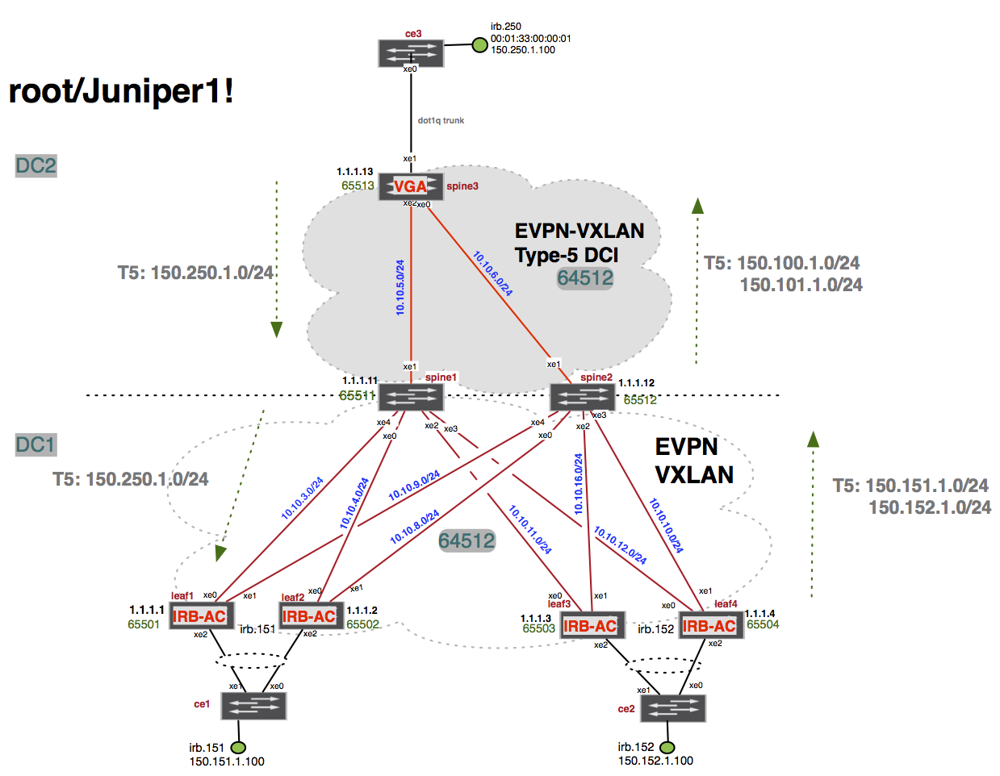

# Lab - section 1 - EVPN-VXLAN - Centrally Routed Overlay - route Type-2


# Lab - section 2 - EVPN-VXLAN - Edge Routed Overlay - route Type-5


# lab ssh access info
`root/Juniper1!`
```
Techfest_EVPN_POD3:
  ce3-re: ce3re-techfestevpnpod1-f0p3ck5w.srv.ravcloud.com
  ce2-re: ce2re-techfestevpnpod1-xlsg8wrz.srv.ravcloud.com
  leaf4-re: leaf4re-techfestevpnpod1-s5eblcod.srv.ravcloud.com
  leaf3-re: leaf3re-techfestevpnpod1-qsrjxfvg.srv.ravcloud.com
  leaf2-re: leaf2re-techfestevpnpod1-fotic68h.srv.ravcloud.com
  leaf1-re: leaf1re-techfestevpnpod1-tc8r2kxk.srv.ravcloud.com
  spine3-re: spine3re-techfestevpnpod1-mkik4flx.srv.ravcloud.com
  spine2-re: spine2re-techfestevpnpod1-nfchrqtc.srv.ravcloud.com
  spine1-re: spine1re-techfestevpnpod1-vvge9ijz.srv.ravcloud.com
```